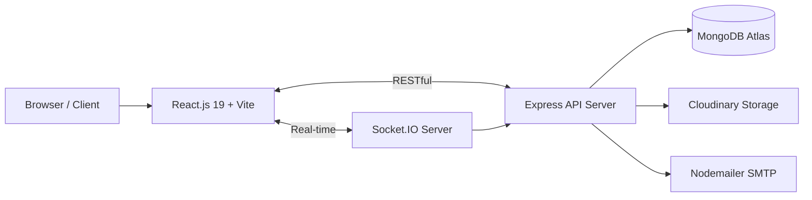

<div align="center">
  

  <h1>Nyan Movie</h1>
  <p><b>The next generation of web-based cinema. Fast, fluid, and responsive.</b></p>
  <p>Built with the MERN Stack and optimized for high-performance video streaming.</p>

  <p>
    <a href="https://nyanmovie.site" target="_blank"><kbd>Live Demo</kbd></a>
    &middot;
    <a href="./docs/project-overview.md"><kbd>Documentation</kbd></a>
    &middot;
    <a href="#quick-start"><kbd>Quick Start</kbd></a>
  </p>

  <p>
    
    
    
    
    
    
    
  </p>
</div>

<hr />

## Overview

Nyan Movie is a modern streaming web application focused on speed, smooth browsing, real-time interaction, and a clean administrative workflow. It simulates the user experience of top-tier streaming platforms, providing a seamless client interface and a robust Content Management System (CMS).

## Key Features

### User Experience

- **Infinite Streaming:** Integrated `hls.js` video player that natively supports `.m3u8` formats and automatically bypasses common browser ad-blocker interferences.
- **Multi-Server Support:** Seamless switching between different video sources (e.g., Subbed, Dubbed) without page reloads.
- **Smart Resume Watching:** LocalStorage-based tracking allows both guests and authenticated users to resume episodes exactly where they left off.
- **Real-time Interaction:** Socket.IO integration for live commenting and typing indicators.
- **Optimized Pagination:** Range-tab rendering for long-running series (1000+ episodes) to ensure DOM performance.

### Admin Dashboard

- **Comprehensive CMS:** Full CRUD operations for Movies, Episodes, Categories, Users, and News.
- **Bulk Processing:** Paste hundreds of URLs at once with auto-mapping and server categorization.
- **SEO Automation:** Automatic URL slug generation and synchronization when updating movie titles.

## System Architecture



## Tech Stack

| Layer | Technology |
|---|---|
| Frontend | React 19, Vite 6, React Router DOM 7, Tailwind CSS, Lucide React, HLS.js, Axios |
| Backend | Node.js (v20 LTS), Express.js, Socket.IO, Nodemailer |
| Database | MongoDB, Mongoose |
| Security & Auth | JWT, bcryptjs, Google OAuth |
| Media Storage | Cloudinary, Multer |
| Deployment | PM2, Nginx, Linux VPS, Bash Automation |

## Quick Start

### 1. Clone the repository

```bash
git clone https://github.com/NhanDuong21/nyan-movie.git
cd nyan-movie
```

### 2. Setup Server

```bash
cd server
npm install
cp .env.example .env
npm run dev
```

### 3. Setup Client

```bash
cd client
npm install
cp .env.example .env
npm run dev
```

Navigate to `http://localhost:5173` to view the application.

## Environment Variables

### `server/.env`

```env
PORT=5000
MONGO_URI=your_mongodb_connection_string
JWT_SECRET=your_jwt_secret
CLIENT_URL=http://localhost:5173

CLOUDINARY_CLOUD_NAME=your_cloud_name
CLOUDINARY_API_KEY=your_api_key
CLOUDINARY_API_SECRET=your_api_secret

GOOGLE_CLIENT_ID=your_google_client_id
GOOGLE_CLIENT_SECRET=your_google_client_secret

EMAIL_USER=your_email@gmail.com
EMAIL_PASS=your_app_password
```

### `client/.env`

```env
VITE_API_URL=http://localhost:5000/api
VITE_GOOGLE_CLIENT_ID=your_google_client_id
```

## Folder Structure

```
nyan-movie/
├── client/          # React + Vite frontend
│   ├── src/
│   │   ├── api/         # Axios configurations
│   │   ├── components/  # Reusable UI components
│   │   ├── layouts/     # Header, Footer, Sidebar
│   │   └── pages/       # Main views (Home, Watch, Admin)
├── server/          # Node.js + Express backend
│   ├── src/
│   │   ├── controllers/ # API logic
│   │   ├── models/      # Mongoose schemas
│   │   ├── routes/      # Express routing
│   │   └── middlewares/ # JWT Auth, Error handling
├── docs/            # Project documentation
└── deploy.sh        # VPS Deployment automation script
```
